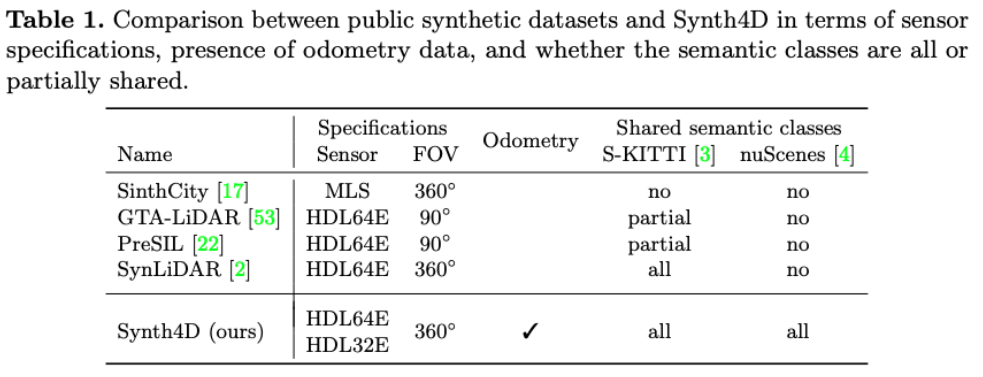

# **GIPSO: Geometrically Informed Propagation for Online Adaptation in 3D LiDAR Segmentation [ECCV2022]**

The official implementation of our work "GIPSO: Geometrically Informed Propagation for Online Adaptation in 3D LiDAR Segmentation".

:fire: Paper link [COMING SOON!]():fire:


## News :bell:
- 7/2022: Synth4D has been uploaded!
- 7/2022: GIPSO code is **OUT**!
- 7/2022: GIPSO is accepted to ECCV 2022!:fire:
- 7/2022: GIPSO repository has been created! Our work is the first allowing source-free online and unsupervised adaptation for 3D LiDAR semantic segmentation!


## Installation
The code has been tested with Python 3.8, CUDA 10.2/11.2, pytorch 1.8.0 and pytorch-lighting 1.4.1.
Any other version may require to update the code for compatibility.

### Pip/Venv/Conda
In your virtual environment follow [MinkowskiEnginge](https://github.com/NVIDIA/MinkowskiEngine).
This will install all the base packages.

Additionally, you need to install:
- [open3d 0.13.0](http://www.open3d.org)
- [KNN-CUDA](https://github.com/unlimblue/KNN_CUDA)
- [pytorch-lighting 1.4.1](https://www.pytorchlightning.ai)
- tqdm
- pickle

If you want to work on nuScenes you need to install
- [nuscenes-devkit](https://github.com/nutonomy/nuscenes-devkit)

### Docker container
If you want to use Docker you can find a pre-compiled container at ```crissalto/online-adaptation-mink:1.3```.

## Synth4D Dataset
We propose a new synthetic LiDAR dataset composed of two splits: one simulating a Velodyne HDL64E (SemanticKITTI) and one simulating a Velodyne HDL32E sensor (nuScenes).



The dataset can be downloaded at the following links:
- [Synthetic Velodyne HDL64E (Synth4D-KITTI)](https://drive.google.com/file/d/1TDB1pH67vQA33WVGSAUQcvyuzml8ZQE0/view?usp=sharing)
- [Synthetic Velodyne HDL32E (Synth4D-nuScenes)](https://drive.google.com/file/d/1EqCDtZeHoZ3g7L2T5fsz5DHdCToXCbBw/view?usp=sharing)
- [Training and validation splits](https://drive.google.com/file/d/1haUPeRCM3ZB_zYrRZgxVQ7gaS-jM9rAj/view?usp=sharing) (used in the paper)


## Data preparation

### Synth4D
Download the Synth4D dataset following the above instructions and prepare the dataset paths as follows:
```
./
├── 
├── ...
└── path_to_data_shown_in_config/
    ├──kitti_synth/
    |   ├──Town03/
    |   |     ├── calib/
    |   |     |    ├── 000000.npy
    |   |     |    └── ... 
    |   |     ├── labels/
    |   |     |    ├── 000000.npy
    |   |     |    └── ...
    |   |     └── velodyne/
    |   |          ├── 000000.npy
    |   |          └── ...
    |   ├──Town06/
    |   ├──Town07/
    |   └──Town10HD/
    ├──nuscenes_synth/
    └──splits/
```


### SynLiDAR
Download SynLiDAR dataset from [here](https://github.com/xiaoaoran/SynLiDAR), then prepare data folders as follows:
```
./
├── 
├── ...
└── path_to_data_shown_in_config/
    └──sequences/
        ├── 00/           
        │   ├── velodyne/	
        |   |	├── 000000.bin
        |   |	├── 000001.bin
        |   |	└── ...
        │   └── labels/ 
        |       ├── 000000.label
        |       ├── 000001.label
        |       └── ...
        └── 12/
```

### SemanticKITTI
To download SemanticKITTI follow the instructions [here](http://www.semantic-kitti.org). Then, prepare the paths as follows:
```
./
├── 
├── ...
└── path_to_data_shown_in_config/
      └── sequences
            ├── 00/           
            │   ├── velodyne/	
            |   |	   ├── 000000.bin
            |   |	   ├── 000001.bin
            |   |	   └── ...
            │   ├── labels/ 
            |   |      ├── 000000.label
            |   |      ├── 000001.label
            |   |      └── ...
            |   ├── calib.txt
            |   ├── poses.txt
            |   └── times.txt
            └── 08/
```

### nuScenes
Follow the instructions [here](https://www.nuscenes.org/nuscenes#download) to download the data and paths will be already like that:
```
./
├── 
├── ...
└── path_to_data_shown_in_config/
          ├──v1.0-trainval
          ├──v1.0-test
          ├──samples
          ├──sweeps
          ├──maps
          └──lidarseg
```
If you need to save space on your server you can remove ``sweeps`` as they are not used.


## Source training

To train the source model on Synth4D
```
python train_lighting.py --config_file configs/source/synth4dkitti_source.yaml
```
For SynLiDAR use ``--config_file configs/source/synlidar_source.yaml``.

For nuScenes ``--config_file configs/source/synth4dnusc_source.yaml``

**NB:** we provide pretrained models in ```pretrained_models```, so you can skip this time consuming step!:rocket:

## Preprocess geometric features
First we need to pre-compute geometric features by using [DIP](https://github.com/fabiopoiesi/dip).
This step will use the pretrained model in ```pretrained_models/dip_model```.

To compute geometric features on SemanticKITTI

```
python compute_dip_features_kitti.py --source_path PATH/TO/SEMANTICKITTI/IN/CONFIGS
```
while to compute geometric features on nuScenes
```
python compute_dip_features_nuscenes.py --source_path PATH/TO/NUSCENES/IN/CONFIGS
```

This will save geometric features in ```experiments/dip_features/semantickitti``` and ```experiments/dip_features/nuscenes```, respectively.


If you want to change features path add ```---save_path PATH/TO/SAVE/FEATURES```.

## Adaptation to target

To adapt the source model Synth4DKITTI to the target domain SemanticKITTI

```
CUBLAS_WORKSPACE_CONFIG=:4096:8 python adapt_online_lighting.py --config_file configs/adaptation/synth4d2kitti_adaptation.yaml --geometric_path experiments/dip_features/semantickitti 
```
The adapted model will be saved following config file in ```pipeline.save_dir``` together with evaluation results.


If you want to save point cloud for future visualization you will need to add ``--save_predictions`` and they will be saved in ```pipeline.save_dir```. 

## References
Reference will be uploaded after publication !:rocket:

## Acknowledgments
The work was partially supported by OSRAM GmbH and was carried out in the Vision and Learning joint laboratory of FBK and UNITN.

## Thanks
We thanks the open source projects [DIP](https://github.com/fabiopoiesi/dip), [Minkowski-Engine](https://github.com/NVIDIA/MinkowskiEngine), and [KNN-KUDA](https://github.com/unlimblue/KNN_CUDA).


